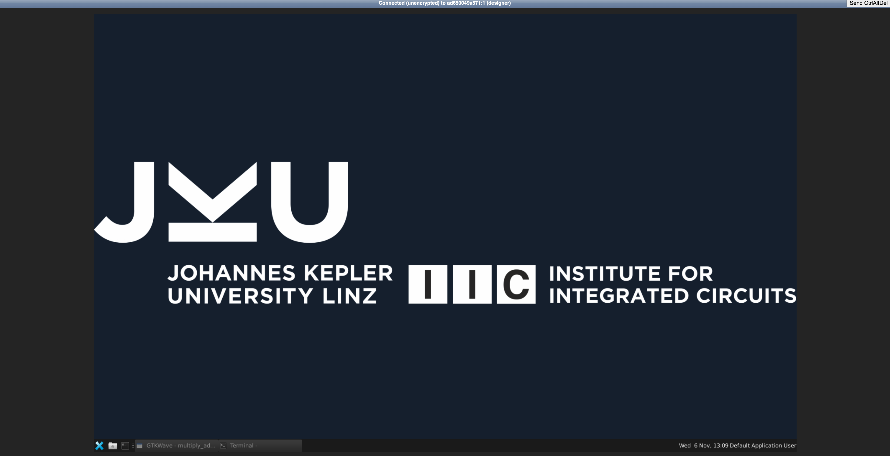
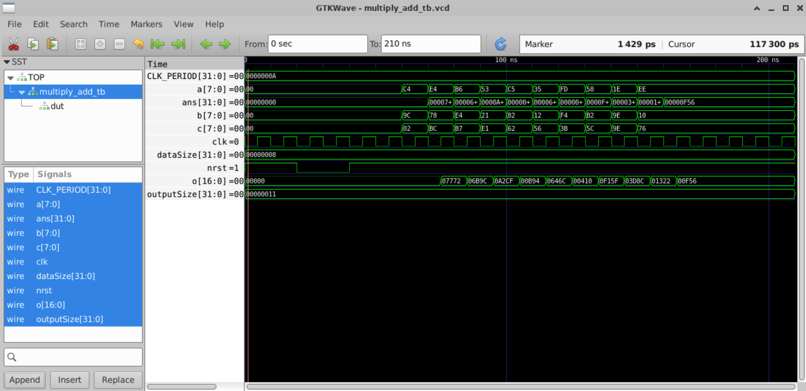

# Lab 1 : OpenLane Installation


# Digital Design

Digital design is the engineering discipline of creating logic circuits. Modern logic circuits are printed on Silicon, creating chips like Intel, Apple, and Qualcomm Processors.

When creating digital circuits today, engineers use Hardware Description Languages (HDLs) like Verilog to describe how their circuits should behave - similar to how programmers use Python or C++ to write software.

For us, we will use Verilog to describe our circuits.

At then end of this lab, you’ll be able to:

- Simulate the RTL designs using Verilator and analyze the waveforms in GTKWave.
- Configure and run the OpenLane flow to synthesize, place, and route the digital designs.
- Customize the pin placements using a `pin_order.cfg` file.
- Explore the final GDSII layout in the KLayout viewer.

# Tools Installation

>!! Skip this part if you are using the Microlab setup for the labs.

If you are not using the Microlab virtual machines for this, please install https://github.com/iic-jku/IIC-OSIC-TOOLS:

1. Download [Docker Desktop](https://www.docker.com/products/docker-desktop/) for your OS 
2. `git clone --depth=1 https://github.com/iic-jku/iic-osic-tools.git`
3. Start Docker Desktop
4. Then, use `./start_vnc.sh`  (or `./start_vnc.bat`, if you’re on Windows)
    1. This part will take a while, as the PDKs and tools are downloaded.
5. Access [localhost](http://localhost) in your browser.
6. Input `abc123` (the default password)

This should show you a desktop environment as below, with all of the requirements already installed.



For those using this installation, make sure to perform all the projects in the directory `~/eda/designs` or `<HOME>/eda/designs` for example, for me, it would be `lquizon/eda/designs` . Create the directory if it does not already exist.

# Setup

1. Preliminary
   1. For people using the Microlab VMs: In a terminal, ssh into your given Microlab VM: e.g. `ssh lquizon@xx.xxx.xx.xxx` 
      1. Go into the openlane2 folder: `cd openlane2`
      2. Start the nix-shell: `nix-shell`
      3. Go back to the home directory: `cd ~`
   2. For people running the **iic-osic-tools** VNC, just make sure to be using the VNC in your browser and then open the terminal.
2. Clone the lab files from the git
    1. `git clone https://github.com/Lawrence-lugs/uLabSynopsysTraining`
3. Enter the cloned directory, and enter the lab1 folder
    1. `cd uLabSynopsysTraining`
    2. `cd lab_1`

# Design and Simulation

Now that we have the environment set up, we can start exploring the sample digital design project. 

The lab1 folder contains a typical project structure for HDL projects:

> * `rtl` — We usually put the main verilog code describing hardware in a folder > named register-transfer level.
>   * `multiply_add.v` — a multiply-add module that uses an array multiplier
>   * `multiply_add_seq.v` — a mutiply-add module that uses a sequential multiplier
>* `tb` — We place “testing” code for verilog- called “testbenches” in the testbench folder.
>    * `tb_multiply_add.v` — a testbench for the multiply-add module.
>    * `tb_multiply_add_seq.v` — a testbench for the multicycle multiply-add module.
>* `sims` — An empty folder where you’ll later on call the Verilator simulation.
>* `openlane` — An empty folder where you’ll later on call the OpenLane ASIC flow. 

1. First, have a look at `multiply_add.v` . This is a verilog file describing a hardware module. 
2. Next, have a look at `tb_multiply_add.v` . This is a verilog file describing a testbench module. We will use the testbench module to provide the test cases when we test the hardware module. 

3. **Icarus Verilog** is a lightweight RTL simulation tool that we will use to simulate the verilog code. 

    Let’s go into the sims directory, then run Icarus Verilog:

    - `> cd sims`
    - `> iverilog ../tb/tb_multiply_add.v  ../rtl/multiply_add.v`

4. A binary executable of the simulation is always produced by Icarus Verilog with the name `a.out` . Let’s execute the simulation:

   - `./a.out`

    This will follow the instructions in the testbench and simulate the RTL. Output logs of the testbench should appear in the terminal.

5. To view the output waveform, do:

   - `> gtkwave multiply_add_tb.vcd`

   `multiply_add_tb.vcd` is a **Value Change Dump (VCD),** which logs the changes of all values in the digital design. This was produced by the testbench in its simulation. To view the signals properly,
   
   1. In the window, select **TOP > multiply_add_tb**
   2. Select all the signals. 
   3. Click append.
   4. Press CTRL + 0 (Zoom fit)

    The signals should all appear in the viewer, as below.

    

    Congratulations! You’ve just finished your first RTL simulations!

 6. Try to simulate `multiply_add_seq.v` with `tb_multiply_add_seq.v`. Show the resulting waveform to the instructor.

> *Can you associate the behavior of the waveforms with what is written in the design files?*

# OpenLane

The digital design workflow that results in an actual chip involves multiple steps:

1. RTL Design — coding the hardware modules in verilog
2. Synthesis — converting our code logic gates.
3. Place and Route — placing and connect these gates on a chip layout
4. Fabrication — Finally, the design is converted to a special format called GDS that can be sent to a factory for manufacturing 

Tools that can do all of the steps after RTL are called RTL to GDS flows. [OpenLane](https://openlane2.readthedocs.io/en/latest/getting_started/newcomers/index.html) is an RTL to GDS flow that’s completely free, and we will be exploring it in this lab.

# Running OpenLane

To run OpenLane, do the following:

1. Go into the OpenLane directory.
2. View the configuration file, `config.json` 
    1. This file contains specific configurations for the OpenLane flow to use for the chip design.
    2. Notice how we specify the **design name** and the **verilog file containing that design.**
3. Next, run `openlane config.json` 
4. Wait for a bit as magic happens.
5. After the OpenLane flow finishes, it leaves all of its resulting files in `runs/RUN__XXXX`. You may explore these files. Most importantly, it creates a folder named `final` which contains things like:
   1. The final Verilog netlist in `final/nl`
   2. The final SPICE netlist in `final/spice` 
   3. The layout design (GDS) file in `final/gds`
6. After the flow finishes, run `openlane config.json --last-run --flow openinklayout` 
    1. This will open the chip layout in a layout viewer called KLayout.

> *Feel free to explore the chip you’ve created. Where are the inputs A and B? Where is the output C?*

# Pin Configurations

We can change the locations of the pins created by OpenLane by adding a file named `pin_order.cfg`

1. Create a file named `pin_order.cfg` in the `openlane` folder with the following contents.

    ```jsx
    #W
    a.*
    b.*
    #N
    d.*
    #E
    o.*
    #S
    clk
    nrst
    ```

1. Add an entry `"FP_PIN_ORDER_CFG": "dir::pin_order.cfg"` to `config.json`
2. Run OpenLane again
3. Open the layout and show the instructor

The `pin_order.cfg` file contains the 4 cardinal directions north, south, east, and west, and also *[regular expressions](https://en.wikipedia.org/wiki/Regular_expression)* pertaining to the pins that should be in those directions.

The above pin order specifies that pins a and b will be in the west, s will be in the north, o will be in the east, and clk and nrst pins are in the south of the design.

Note that pin orders need to contain *all of the pins.* 

> *Explore the chip you've created again. Where are the ports now?* 

# Changing the Target

Next, let’s try to change the openlane target design.

1. Edit `config.json` to target `multiply_add_seq.v` instead of `multiply_add.v`
2. Edit `pin_order.cfg` to account for all the pins you see in `multiply_add_seq.v`
3. Run openlane
4. Once it finishes, view the layout in KLayout and show the lab instructor.

# Lab Deliverables

1. Show the instructor the waveforms of the *mult_add_seq* simulation.
2. Show the instructor the layout of the *mult_add* with pin orders configured.
3. Show the instructor the layout of the *mult_add_seq* module.