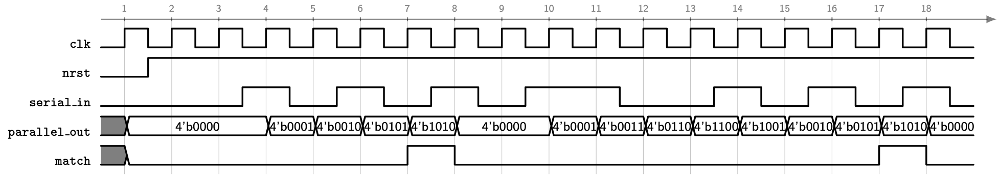

# Lab 2 : Simple Sequential Circuit

# Introduction
The aim of this laboratory exercise is to design a simple sequential circuit in Verilog.

# Specifications
In this exercise, you will be designing a serial pattern detector that detects the pattern `1010`.

## Interface
The table shows the external interface of the serial pattern detector. The `clk` and `nrst` inputs serve as the clock and active-low asynchronous reset, respectively. Asserting `nrst` (i.e., setting it to $0$) should set the outputs `parallel_out` and `match` to $0$. You are required to set the module name to `pattern_detector`.

| Port name | Direction | Width | Description |
|---|---|---|---|
| `clk` | in | 1 | clock |
| `nrst` | in | 1 | active-low asynchronous reset |
| `serial_in` | in | 1 | input data |
| `parallel_out` | out | 4 | serial-to-parallel output, reflecting the four most recent `serial_in` values |
| `match` | out | 1 | match flag |

## Operation
The serial pattern detector should detect the pattern `1010`. At each rising edge of the clock, the detector shifts in a 1-bit value from the input `serial_in` into a 4-bit output, `parallel_out`, at the least significant bit (LSB). When `parallel_out` matches the target pattern `1010`, the 1-bit output `match` asserts to $1$ for one clock cycle. The `parallel_out` should then reset to `4'b0000` at the next clock cycle following a match, ignoring the input from `serial_in` at that clock cycle. The detector will then be ready to accept new data from `serial_in` in the subsequent clock cycle. 

## Design Verification
A sample timing diagram for the serial pattern detector is shown in the figure below. A shaded value in gray means that the signal is uninitialized. Use the provided [testbench](tb/tb_pattern_detector.v) to verify the functionality of your design. Show the waveforms to your instructor.

