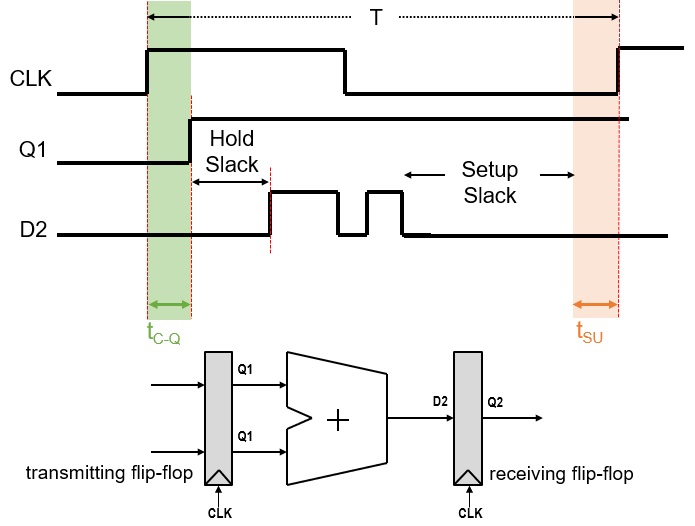

# Lab 3 : Synthesis and Timing


# Prerequisites

For this lab, you must have finished lab 1 with the Microlab setup.

To prepare, clone `git clone https://github.com/Lawrence-lugs/uLabSynopsysTraining` again. 

# Gate-level Netlists

So far, we’ve only created RTL designs, simulated them, then skipped straight into the physical design. More typically, we perform after the design has been turned into a *gate-level netlist*.

1. First off, run OpenLane again inside the `openlane` folder.
2. Inside `runs/RUN_XXX/final/nl`, you can see a verilog file containing the final netlist of your design. Inspect the inside of the file with `gedit ___.v`
    
    This file instantiates various standard gates from the Skywater 130nm  high-density digital standard cell library (*sky130_fd_sc_hd*), replacing the behavioral statements in `multiply_add.v`.

3. The file `runs/RUN_XXX/final/sdf/nom_tt_025C_1v80/multiply_add__nom_tt_025C_1v80.sdf`, is a **standard delay format** file which describes 

    At its beginning, the SDF file describes the *propagation delay* of each gate and wire for both the *rising* and the *falling edges*.

    ```
    1149  (CELL
    1150   (CELLTYPE "sky130_fd_sc_hd__and3_1")
    1151   (INSTANCE _348_)
    1152   (DELAY
    1153    (ABSOLUTE
    1154     (IOPATH A X (0.175:0.175:0.175) (0.155:0.155:0.155))
    1155     (IOPATH B X (0.239:0.239:0.239) (0.227:0.227:0.227))
    1156     (IOPATH C X (0.206:0.206:0.206) (0.224:0.224:0.224))
    1157    )
    1158   )
    1159  )
    ```

    Additionally, the SDF describes the *setup, hold, recovery and CLK width required* for each flip-flop in the design.

    ```
    5201  (CELL
    5202   (CELLTYPE "sky130_fd_sc_hd__dfrtp_1")
    5203   (INSTANCE _705_)
    5204   (DELAY
    5205    (ABSOLUTE
    5206     (IOPATH CLK Q (0.309:0.309:0.309) (0.346:0.346:0.346))
    5207     (IOPATH RESET_B Q () (0.000:0.000:0.000))
    5208    )
    5209   )
    5210   (TIMINGCHECK
    5211     (REMOVAL (posedge RESET_B) (posedge CLK) (0.349:0.349:0.349))
    5212     (RECOVERY (posedge RESET_B) (posedge CLK) (-0.204:-0.204:-0.204))
    5213     (HOLD (posedge D) (posedge CLK) (-0.036:-0.043:-0.051))
    5214     (HOLD (negedge D) (posedge CLK) (-0.043:-0.046:-0.050))
    5215     (SETUP (posedge D) (posedge CLK) (0.061:0.069:0.077))
    5216     (SETUP (negedge D) (posedge CLK) (0.111:0.115:0.118))
    5217     (WIDTH (posedge CLK) (0.256:0.256:0.256))
    5218     (WIDTH (negedge CLK) (0.191:0.191:0.191))
    5219     (WIDTH (posedge RESET_B) (0.365:0.365:0.365))
    5220   )
    5221  )
    ```

# Gate-level Simulation

We can confirm that the circuit works as intended by simulating the gate-level netlist and annotating it with the delays described by the SDF file. We call this *gate-level simulation* and opposed to the *RTL simulation* we have done in labs 1 and 2.

1. Uncomment the `$sdf_annotate("<SDF_FILE>",dut);` line in the testbench. This will instruct the testbench to associate the delays described in the SDF file to the corresponding gate and instance in the netlist file.
2. Uncomment the first 4 lines of the testbench:

    ```
    `define UNIT_DELAY #1
    `define FUNCTIONAL
    `include "/local/pdk/sky130A/libs.ref/sky130_fd_sc_hd/verilog/primitives.v"
    `include "/local/pdk/sky130A/libs.ref/sky130_fd_sc_hd/verilog/sky130_fd_sc_hd.v"
    ```

    This will allow the testbench to see the model files of the standard cells. These files describe how the standard cells work and are given by the foundry.
3. To perform the simulation, we will use Synopsys' *Verilog Compiler and Simulator (VCS)*. This is a paid closed-source simulator with support for *SDF annotation*, unlike Icarus or Verilator ([see also](https://openlane2.readthedocs.io/en/latest/usage/timing_closure/index.html#sdf-annotated-gl-simulation-using-cvc)).

    1. First, do `source ~/set_synopsys_bash.sh`
    2. `vcs -full64 -R ../tb/tb_multiply_add.v ../openlane/runs/RUN_XXXX/final/nl/multiply_add.nl.v` (make sure to replace RUNS_XXXX with the proper location)

        The simulation should work as it did for the RTL simulations.

4. View the waveform of your simulation. What's different from when we did the RTL simulations? (Hint: Check the output signal `o[15:0]` from the multiply-adder). 
5. Repeat the above for *multiply_add_seq.v*. Show the output waveform to the instructor.

# Static Timing Analysis Reports 

STA stands for *static timing analysis*. During the OpenLane flow, the gate-level representation of the design is repeatedly analyzed for correctness of timing.

You can view STA reports inside `openlane/runs/RUN_XXXX/54-openroad-stapostpnr/nom_tt_025C_1v80`

We care most about `min.rpt` for HOLD slack, and `max.rpt` for SETUP slack.

**SLACK** is the amount of leeway we have in the logic path before there is a timing violation.



Based on the remaining setup slack, we can infer a good clock period for the circuit by subtracting it from the current clock period.

1. Infer a good clock period for `multiply_add.v` based on the remaining setup slack.
2. Set that clock period in `openlane/config.json`.
3. Run openlane
4. Change the clock period defined in `tb_multiply_add.v`
5. If OpenLane succeeds, run a post-PnR gate-level simulation again and show the output waveform to the instructor. 
6. Repeat the above for `multiply_add_seq.v`
      
# Timing Constraints and Synthesis

Using the SDF files and the standard cell models, the tool already knows the behavior of internal gates and can create the physical circuit accordingly. However, things that are from outside the design, like the inputs, the outputs, the clock, and the reset button, are not yet known by the tool.

OpenLane automatically generates an SDC file in the absence of one. You can see it inside `openlane/runs/RUN_XXX/final/sdc`.

Inside it are different terms like
* `create_clock` - sets the clock period and port name for the clock in ns
* `set_clock_transition` - sets the rise and fall time of the clock in ns
* `set_clock_uncertainty` - sets the clock uncertainty in ns
* `set_input_delay` - sets the delay for an input port to add to the signal, assuming the signal is thrown by a flip-flop beforehand.
    
    

* `set_output_delay` - sets the delay that an output port adds, assuming the signal is also captured by a flip-flop after that.

    

* `set_load` - sets a capacitance load to a port

Let's change the design constraints by writing our own more concise SDC file.

1. Create a new SDC file with the following constraints:

    ```tcl
    create_clock -name clk -period 10 [get_ports {clk}]
    set_clock_uncertainty 1 clk
    set_input_delay 2 -clock [get_clocks {clk}] -add_delay [get_ports {a*}]
    set_input_delay 2 -clock [get_clocks {clk}] -add_delay [get_ports {b*}]
    set_output_delay 2 -clock [get_clocks {clk}] -add_delay [get_ports {o*}]
    ```

    > *Note: the clock defined here overrides the clock defined in config.json*

2. Add `"PNR_SDC_FILE": "dir::new.sdc"` to `config.json`
3. Run the PNR again.
4. Check the output SDC file in `final/sdc`. Did our SDC files get used?
5. Increase one of the input delays to 6ns. The OpenLane flow should finish, but throw an error.
    > *Why?*
6. Open `runs/RUN_XXXX/54-sta-postpnr/nom_tt_025C_1v80/violator_list.rpt`. This shows which path violates timing rules, what type of violation it is, and the throwing/capturing flip-flop involved.
7. To know what exact gates the offending path passes through, inspect `runs/RUN_XXXX/54-sta-postpnr/nom_tt_025C_1v80/max.rpt`.
8. Despite the error, OpenLane has finished the place and route procedure anyway. The final netlist can be found in `runs/RUN_XXXX/51-openroad-fillinsertion/multiply_add.nl.v`. 
   
   Sometimes, timing violations found are actually irrelevant to the normal operation of the circuit. To confirm if our circuit still works, run a gate-level simulation with this netlist.

   The new SDF file is inside `54-openroad-stapostpnr/nom_tt_025C_1v80/multiply_add__nom_tt_025C_1v80.sdf`

    Make sure to change the $sdf_annotate(<FILE>,dut); line in the testbench.

9.  Show the output waveforms to the instructor. Explain why the timing violation did not change anything.

# Lab Deliverables
1. Show the sequential multiply-adder gate-level simulation to the instructor.
2. Show the sequential multiply-adder gate-level simulation after PnR with a lower clock period to the instructor.
3. Show the multiply-adder gate-level simulation after PnR with your own SDC file to the instructor. 

<!-- #

We use *Synopsys Design Constraints* (SDC) files to tell the digital design tools what to expect from external signals, like the **inputs, the outputs, and the clock**.

1. First, inspect the SDC file inside `openlane/runs/RUN_XXX/final/sdc`. This is an auto-generated SDC file by OpenLane describing the 

For the OpenLane flow, this step is performed by the Yosys tool in *OpenLane Step 06*.

In this lab, we will use a different tool to perform synthesis, the **Synopsys Design Compiler (DC).**

1. First, go into the lab3 directory
    1. `cd lab3`
2. Run `source set_synopsys.sh`. This will allow you to run the Synopsys tools. 
3. Next, run the -->