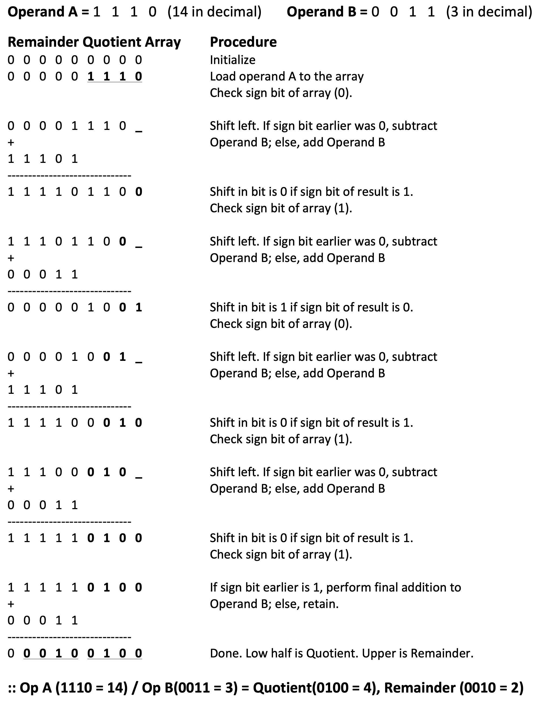
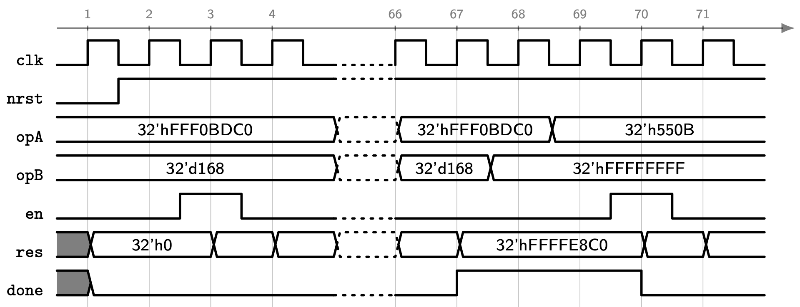

# Machine Problem : Sequential Divider

# Introduction
We typically design and implement synchronous digital designs using finite-state machine (FSM) techniques. Such methods have been effective since the digital circuits to be implemented have predictable outputs and a relatively small number of states. For large system designs with a huge number of states, these techniques might not be practical anymore. 
		
Register-transfer level (RTL) is a design abstraction that models a synchronous digital circuit in terms of the flow of data between hardware registers and the logical operations performed on those data. RTL design methodology enables digital designers to design circuits of higher complexity with ease. With this, design at the RTL level is a typical practice in digital design. In this machine problem, you will be implementing a digital system at the RTL level, which would be impractical to develop if the conventional techniques are used.

# Specifications
In this exercise, you will be designing a signed sequential division hardware. 

## Interface
The table below shows the external interface of the signed sequential divider. The `clk` and `nrst` inputs serve as the clock and active-low asynchronous reset, respectively. Asserting `nrst` (i.e., setting it to $0$) should set the outputs `res` and `done` to $0$. The `en` signal is a high-asserted 1-bit input which initiates the computation. If `en` is asserted for 1 clock cycle, the computation starts. It can be de-asserted once the computation procedure has started. The sequential divider takes in two operands, `opA` and `opB`, and produces a result, `res`. The done signal is a high-asserted 1-bit output which asserts whenever the computation procedure is finished. Once it is asserted, the result of the computation should be present at the output `res`. Both outputs will hold their values until another operation is requested (i.e., when `en` is asserted again). You are required to set the module name to *div*. 

| Port name | Direction | Width | Description |
|---|---|---|---|
| `clk` | in | 1 | clock |
| `nrst` | in | 1 | active-low asynchronous reset |
| `opA` | in | 32 | first operand |
| `opB` | in | 32 | second operand |
| `en` | in | 1 | enable signal |
| `res` | out | 32 | quotient of the operands  |
| `done` | out | 1 | done signal |

## Operation
The sequential non-restoring division algorithm operates as follows. The example shows 4-bit unsigned operands. 

Your divider should accept 32-bit operands and produce a 32-bit result. The 32-bit operands are assumed to be represented in two's complement notation. For 32-bit operands, the sequential division algorithm requires 32 iterations, each requiring shift, addition/subtraction, and setting the least significant bit (LSB) of the quotient. For this exercise, you will implement the sequential divider hardware such that an iteration is completed after two clock cycles; that is, one clock cycle for shift and addition/subtraction, and another one for setting the least significant bit (LSB) of the quotient. As a result, the computation is finished after 64 clock cycles. 

## Design Verification
A sample timing diagram for the sequential divider is shown in the figure below. A shaded value in gray means that the signal is uninitialized. For the computation that is initiated at clock cycle 3, the result will be available only at clock cycle 67 (i.e., after 64 clock cycles). The outputs, `res` and `done`, are held until the `en` signal is asserted (i.e., at clock cycle 70). 

Use the provided [testbench](tb/tb_div.v) to verify the functionality of your unsynthesized and synthesized designs. Show the waveforms to your instructor.